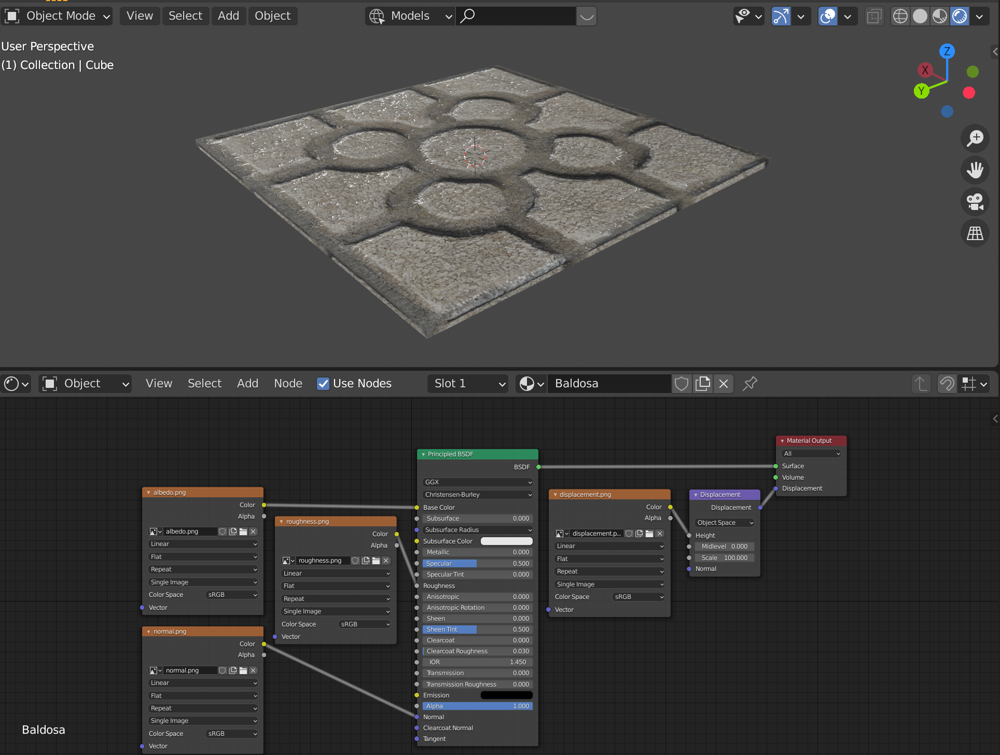

# blender-to-realitykit

As I've been learning how to create augmented reality (AR) apps for iOS through my development of [Juego de la Rana](github.com/radcli14/larana), one of the topics I'm constantly revisiting is how to import my own 3D content.
In that case, I have three unique objects that are included:

1. A frog statue, created using [Photogrammetry](https://www.dc-engineer.com/my-first-ar-app-on-ios-juego-de-la-rana/),
2. A table the statues sits upon, created in [Blender](https://www.blender.org/),
3. A city scene, also created in Blender.

The Juego de la Rana app is created in iOS-native Swift using the RealityKit framework, which uses a "Universal Scene Description" (`.usdz`) file format for importing 3D model files.
This is Apple's preferred format, long used my Pixar for rendering their own 3D content, however it is not especially common in other 3D modeling communities, in particular Blender users.
As such, my experience is that while you can _absolutely_ produce quality 3D content for RealityKit using Blender, the process is by no means seemless, and it took me a bit of trial and error to understand the workflow.

To help others adapt this workflow, I have created this example for creating content in Blender and exporting to RealityKit for AR apps on iOS and VisionOS.
Ultimately, while the process is not overwhelmingly cumbersome, however, understanding that Blender is free software and not optimized-for-Apple, its not necessarily easy or obvious either.
The guide that follows will go into detail into demonstrating how to transfer a fairly simple model from Blender into a working VisionOS and iOSP app, but if you were to skim over those details, a few points that I hope you will take away from this example are:

- The `.usdz` file format is supported by Blender, however, I find using this file _as-is_ will generally not work as-intended,
- Blender is typically better suited to exporting "Graphics Library Transmission Format Binary" (`.glb`) format, which is not natively imported into RealityKit,
- Apple's [Reality Converter](https://developer.apple.com/augmented-reality/tools/) tool can load `.glb` and convert to `.usdz` fairly reliably,
- Apple's [Reality Composer Pro](https://developer.apple.com/augmented-reality/tools/) tool can clean up the materials and lighting in the converted `.usdz` file,
- `RealityView` in SwiftUI may be used for both VisionOS and iOS from iOS 18 and onward.

As an example, I'm going to create a fairly simple Blender model, but one that includes a couple features that tend to challenge the file export a conversion.
I will follow this up by creating an XCode project for an AR app, and show it being built in both VisionOS and iOS with our custom 3D model.

## Building the Model in Blender

Our Blender model includes a single [_Baldosa de Bilbao_](https://es.wikipedia.org/wiki/Baldosa_de_Bilbao) tile, and a spinning head of the Blender mascot, Suzanne.
The Baldosa is created with an image texture containing albedo (color), roughness, normal, and displacement, with the UV's edited to center the pattern on the tile.
Suzanne is given a slightly translucent base color, and a bit of a green emissivity.
Suzanne's head is animated to rotate one full cycle every second, with the result looking like below.


<!--
| Default Cube                               | Resizing                               | Shifting Up                               |
|--------------------------------------------|----------------------------------------|-------------------------------------------|
|  |  |  |
-->

### Creating the Baldosa Material

The Baldosa tile in the model is one meter square and two centimeters thick.
When starting the model, I could have used the default cube for this purpose, however, I ended up deleting that (as is tradition), and instead creating a 1 meter plane, and then extruding the two centimeter thickness.
For whatever reason, I found the textures and UV's to map a bit nicer onto the plane than on the cube; I have no reason for this, that just is what it is.

I use a physics-based rendering (PBR) texture set that I created on the [PolyCam website](https://poly.cam/) from a photograph that I took myself.
For those unfamiliar, this is a style of tile that is seen all throughout the city of Bilbao and surrounding towns, designed to be non-slip during the persistent _sirimiri_ (light rain) that is common here.
The PBR material contains albedo (base color), roughness, normal vectors encoded as red-green-blue (RGB) colors, and displacement maps, seen below.

| Albedo                               | Roughness                                  | Normal                               | Displacement                                    |
|--------------------------------------|--------------------------------------------|--------------------------------------|------------------------------------------------------|
|  |  |  |  |

In the "Object Mode" in the layout or modeling tab, I select the tile and open the "Material Properties" menu signified by the red circular icon on the right hand side of the window.
If there is not already a material slot for this object, we can create one by tapping the plus `+` symbol in the upper right, and then right click to rename this material "Baldosa."

When using a PBR material with multiple texture slots, the simplest way to add these properties is typically by switching to the "Shading" tab at the top of the window.
At this time, if you haven't already, you should install the [Node Wrangler](https://docs.blender.org/manual/en/latest/addons/node/node_wrangler.html) add-on, which you can access through "Edit -> Preferences -> Add-ons."
This will, among other things, enable keyboard shortcuts in the node editor, which is the diagram at the bottom of the screen.
To put this to use, now hover your mouse over the "Principled BSDF" block in the node editor, and press "Control-Shift-T."
A file browser will open up, in which you can select the `albedo.png`, `roughness.png`, `normal.png`, and `displacement.png` files that I referenced above, which are each located in the `blends/baldosa` folder of this project.
Once you click the "Principled Texture Setup" button with these selected, the material slots will be populated with those image files, with supporting blocks added to assure they map properly onto the object.
An incredible convenience provided by Node Wrangler compared to creating these blocks manually!


The image above shows what I would call the "final product" of the PBR material creation, however, there are a couple more steps I took to get there.
One of these steps is to propertly center the texture in the object's [UV map](https://docs.blender.org/manual/en/latest/modeling/meshes/uv/applying_image.html), which describes how the image texture wraps around the object.
In my example, I selected the four shorter corner edges, right-clicked and selected "mark seams," then  tapped the "A" key to select all faces, tapped the "U" key to open up unwrapping menu, then selected the "unwrap" option.
From here, I used the UV editor on the left hand side to scale and translate the faces until the textures lined up so that a single tile showed up on the top face, like what is seen in the image below.


Another last note is that the PBR material in Blender includes a displacement channel, which is handled in a bit of a unique way. This won't transfer nicely into RealityKit, but does make for a nice effect in the Blender rendering.
To enable displacement, I use the Cycles renderer, then add a "Subdivide Surface" modifier to the tile object, toggle "Simple" mode, and click the "Adaptive Subdivision" option.
With displacement turned on, I found the sides and bottom to look a bit weird, so I ended up assigning plain gray material (untextured) to these sides.

<!--
| Renaming material                                    | Base color texture                                       | Added albedo                                              |
|------------------------------------------------------|----------------------------------------------------------|-----------------------------------------------------------|
|     |        |         |
| Incorrect UV scaling                                 | Cube projection                                          | Better UV scaling                                         |
|  |           |         |
| UV repositioning                                     | Duplicating texture node                                 | Final material appearance                                 |
|      |  |  |
-->

### Adding Suzanne

The monkey head, named "Suzanne" by Blender users, is added by switching to the Layout or Modeling tab, making sure we are in object mode, clicking on the "Add" menu, "Mesh," and then "Monkey."
In the example, I have used the menu that appears in the bottom left to set the scale of the head to 0.9 meters, locate it 0.7 meters upward in the Z direction, and rotate it by 45 degrees around the Z axis, which looks nice relative to the size and location of the tile.

...Added material


<!--
| Select the Monkey mesh                            | Scale and rotate                            |
|---------------------------------------------------|---------------------------------------------|
|  |  |

| Add material slot                                    | Reduce alpha                                      |
|------------------------------------------------------|---------------------------------------------------|
|  |       |
| Add emission                                         | Zero roughness                                    |
|       |  |
-->

### Animating

| | |
|---|---|
|  |  |
| | |
|  |  |
| | |
|  |  |
| | |
|  |  |


## Generating a `USDZ` formatted file

### Trying Blender's "Built-In" Export

| | |
|---|---|
|  |  |


### With Blender's `GLB` Export and Reality Converter


## Building the RealityKit App

```swift
WindowGroup {
    ContentView()
        .environment(appModel)
}
.windowStyle(.volumetric)
.defaultSize(width: 2, height: 2, depth: 2, in: .meters)
```

In `ContentView.swift`
```swift
scene.availableAnimations.forEach { animation in
    scene.playAnimation(animation.repeat(duration: .infinity))
}
```
