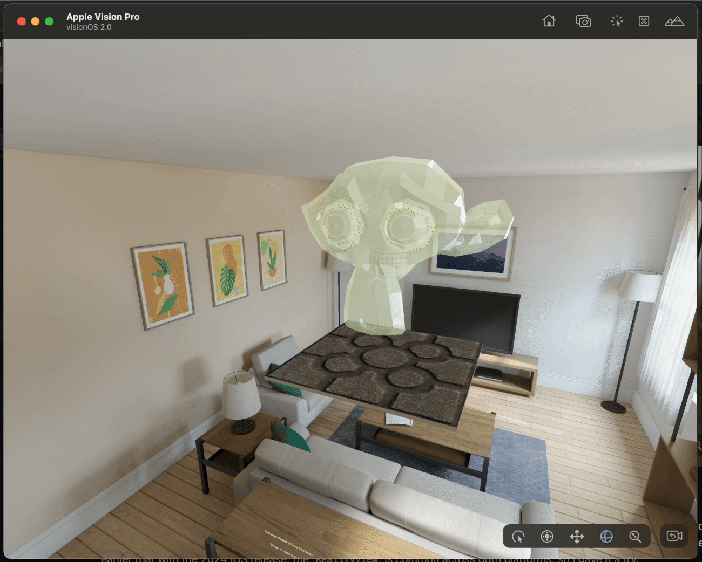
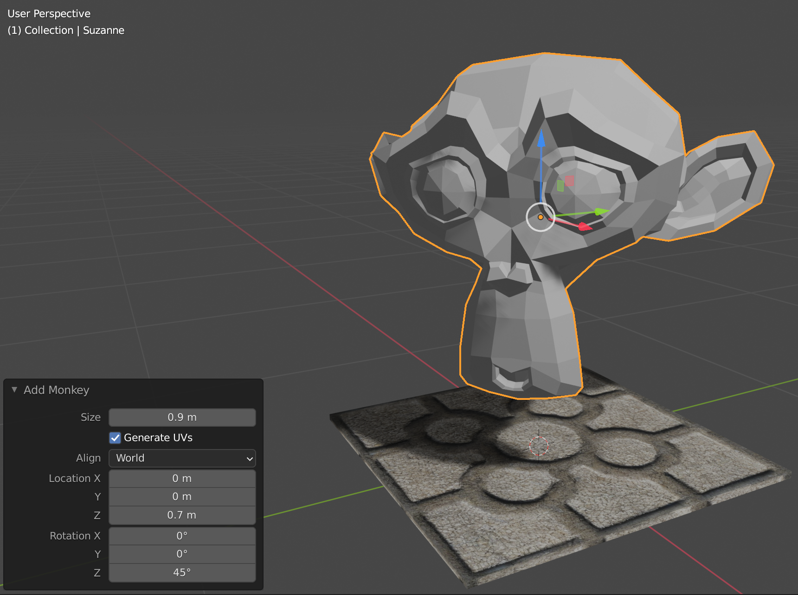
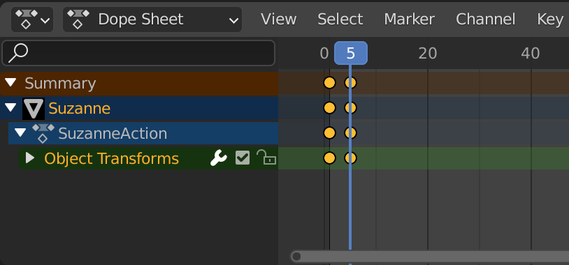
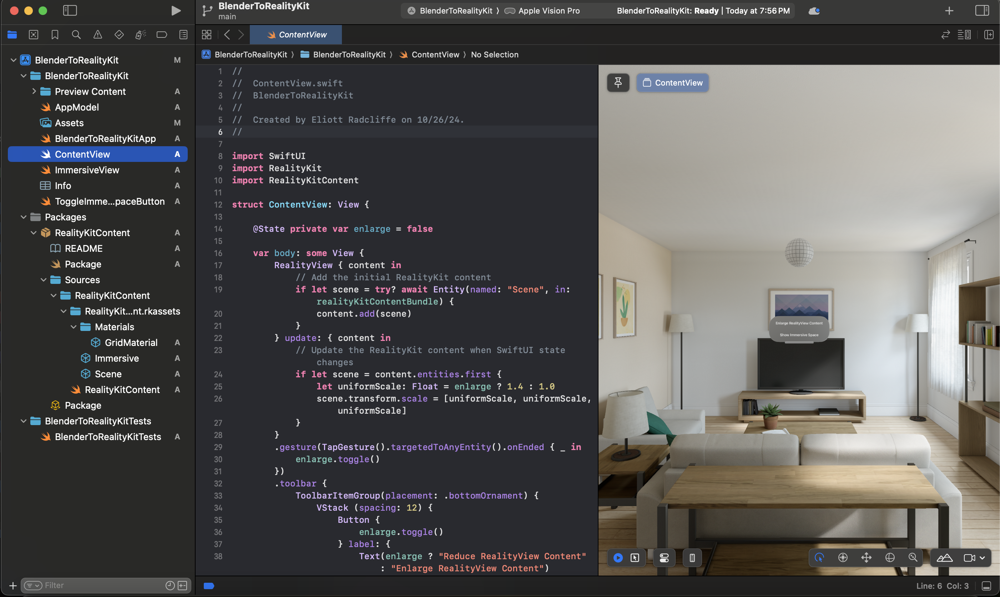

# Tutorial for Exporting Models from Blender to RealityKit for AR Apps VisionOS and iOS 



As I've been learning how to create augmented reality (AR) apps for iOS through my development of [Juego de la Rana](github.com/radcli14/larana), one of the topics I'm constantly revisiting is how to import my own 3D content.
In "La Rana," I include three unique objects:

1. A frog statue, created using [Photogrammetry](https://www.dc-engineer.com/my-first-ar-app-on-ios-juego-de-la-rana/),
2. A table the statue sits upon, created in [Blender](https://www.blender.org/),
3. A city scene, also created in Blender.

The Juego de la Rana app is created in iOS-native Swift using the RealityKit framework, which uses a "Universal Scene Description" (`.usdz`) file format for importing 3D model files.
This is Apple's preferred format, long used by Pixar for rendering their own 3D content.
However, it is not especially common in other 3D modeling communities, in particular, Blender users.
As such, my experience is that while you can _absolutely_ produce quality 3D content for RealityKit using Blender, the process is not seamless, and it took me a bit of trial and error to understand the workflow.

To help others adapt this workflow, I have created this tutorial for creating content in Blender and exporting to RealityKit for AR apps on iOS and VisionOS.
The process is not overwhelmingly cumbersome, however, understanding that Blender is free software and not optimized-for-Apple, its not necessarily easy or obvious either.

This guide will go into detail into demonstrating how to transfer a fairly simple model from Blender into a working VisionOS and iOS app, but if you were to skim over those details, a few points that I hope you will take away from this example are:

- The `.usdz` file format is supported by Blender, however, I find using this file _as-is_ will generally not work as-intended,
- Blender is typically better suited to exporting "Graphics Library Transmission Format Binary" (`.glb`) format, which is not natively imported into RealityKit,
- Apple's [Reality Converter](https://developer.apple.com/augmented-reality/tools/) tool can load `.glb` and convert to `.usdz` fairly reliably,
- Apple's [Reality Composer Pro](https://developer.apple.com/augmented-reality/tools/) tool can clean up the materials and lighting in the converted `.usdz` file,
- `RealityView` in SwiftUI may be used for both VisionOS and iOS from iOS 18 and onward.

As an example, I'm going to create a fairly simple Blender model, but one that includes a few features that tend to challenge the file export and conversion, namely materials, animations, and lights.
I will follow this up by creating an XCode project for an AR app, and show it being built in both VisionOS and iOS with our custom 3D model.

To a regular Blender user, I expect the first section to be fairly basic, as it solely is used to create the subject matter for the tutorial.
If you are primarily interested in how to add this content to RealityKit, you may prefer to skip to the second section discussing the model file exports.


## Building the Model in Blender

Our Blender model includes a single [_Baldosa de Bilbao_](https://es.wikipedia.org/wiki/Baldosa_de_Bilbao) tile, and a spinning head of the Blender mascot, Suzanne.
The baldosa is created with an image texture containing albedo (color), roughness, normal, and displacement, and the UV's are edited to center the pattern on the tile.
Suzanne is given a slightly translucent base color, a bit of a green emissivity, and her head is animated to rotate one full cycle every second.
The result is shown below.


<!--
| Default Cube                               | Resizing                               | Shifting Up                               |
|--------------------------------------------|----------------------------------------|-------------------------------------------|
|  |  |  |
-->

### Creating the Baldosa Material

The baldosa tile in the model is one meter square and two centimeters thick.
When starting the model, I could have used the default cube for this purpose, however, I ended up deleting that (as is tradition), and instead creating a 1 meter plane, and then extruding the two centimeter thickness.
For whatever reason, I found the textures and UV's to map a bit nicer onto the plane than on the cube; I have no reason for this, it is what it is.

I use a physics-based rendering (PBR) texture set that I created on the [PolyCam website](https://poly.cam/) from a photograph that I took myself.
For those unfamiliar, this is a style of tile that is seen all throughout the city of Bilbao and surrounding towns, designed to be non-slip during the persistent _sirimiri_ (light rain) that is common here.
The PBR material contains albedo (base color), roughness, normal, and displacement maps, as seen below.

| Albedo                               | Roughness                                  | Normal                               | Displacement                                    |
|--------------------------------------|--------------------------------------------|--------------------------------------|------------------------------------------------------|
|  |  |  |  |

In "Object Mode" in the layout or modeling tab, I select the tile and open the "Material Properties" menu signified by the red circular icon on the right hand side of the window.
If there is not already a material slot for this object, we can create one by tapping the plus `+` symbol in the upper right, and then right click to rename this material "Baldosa."

When using a PBR material with multiple texture slots, the simplest way to add these properties is typically by switching to the "Shading" tab at the top of the window.
At this time, if you haven't already, you should install the [Node Wrangler](https://docs.blender.org/manual/en/latest/addons/node/node_wrangler.html) add-on, which you can access through "Edit -> Preferences -> Add-ons."
This will, among other things, enable keyboard shortcuts in the node editor, which is the diagram at the bottom of the screen.
To put this to use, now hover your mouse over the "Principled BSDF" block in the node editor, and press "Control-Shift-T."
A file browser will open up, in which you can select the `albedo.png`, `roughness.png`, `normal.png`, and `displacement.png` files that I referenced above, which are each located in the `blends/baldosa` folder of this project.
Once you click the "Principled Texture Setup" button with these selected, the material slots will be populated with those image files, with supporting blocks added to assure they map properly onto the object.
An incredible convenience provided by Node Wrangler compared to creating these blocks manually!


The image above shows what I would call the "final product" of the PBR material creation, however, there are a couple more steps I took to get there.
One of these steps is to propertly center the texture in the object's [UV map](https://docs.blender.org/manual/en/latest/modeling/meshes/uv/applying_image.html), which describes how the image texture wraps around the object.
In my example, I selected the four shorter corner edges, right-clicked and selected "mark seams," then tapped the "A" key to select all faces, tapped the "U" key to open up unwrapping menu, and selected the "unwrap" option.
From here, I used the UV editor on the left hand side to scale and translate the faces until the textures lined up so that a single tile showed up on the top face, like what is seen in the image below.


Another last note is that the PBR material in Blender includes a displacement channel, which is handled in a bit of a unique way. This won't transfer nicely into RealityKit, but does make for a nice effect in the Blender rendering.
To enable displacement, I use the Cycles renderer, then add a "Subdivide Surface" modifier to the tile object.
In the modifier, I toggle "Simple" mode, and click the "Adaptive Subdivision" option.
With displacement turned on, I found the sides and bottom to look a bit weird, so I ended up assigning a plain gray material (untextured) to these sides.

<!--
| Renaming material                                    | Base color texture                                       | Added albedo                                              |
|------------------------------------------------------|----------------------------------------------------------|-----------------------------------------------------------|
|     |        |         |
| Incorrect UV scaling                                 | Cube projection                                          | Better UV scaling                                         |
|  |           |         |
| UV repositioning                                     | Duplicating texture node                                 | Final material appearance                                 |
|      |  |  |
-->

### Adding Suzanne

The monkey head, named "Suzanne" by Blender users, is added by switching to the Layout or Modeling tab, making sure we are in object mode, clicking on the "Add" menu, "Mesh," and then "Monkey."
In the example, I have used the menu that appears in the bottom left to set the scale of the head to 0.9 meters, locate it 0.7 meters upward in the Z direction, and rotate it by 45 degrees around the Z axis, which looks nice relative to the size and location of the tile.
I used a much simpler material for Suzanne, where I set the roughness to zero to make her shiny, set transmission to 0.5 to make her translucent, and added a slight green emission, giving the appearance seen below.


<!--
| Select the Monkey mesh                            | Scale and rotate                            |
|---------------------------------------------------|---------------------------------------------|
|  |  |

| Add material slot                                    | Reduce alpha                                      |
|------------------------------------------------------|---------------------------------------------------|
|  |       |
| Add emission                                         | Zero roughness                                    |
|       |  |
-->

### Animating

I added a simple animation to this example, as I know this is one aspect that may not always be passed properly along with the file export and conversion.
In this case, I animated a simple rotation about the vertical axis, which repeats on a one second loop.

I start by switching to the animation tab, selecting Suzanne, and while hovering over her tapping the "I" key to bring up the keyframe menu.
From here, selecting the rotation option will create our first keyframe at frame 1, which will hold the initial rotation as already specified.

In the dope sheet at the bottom, now reposition to the fifth frame.
In the "Object Properties" menu on the right side, which is the orange square icon, change the Z axis rotation to 105 degrees. 
The color of the angle field will temporarily change to orange, which indicates a change from the current animation.
While hovering over this field, tap the "I" key again to create a new keyframe that holds this rotation.

Lastly, we want to interpolate linearly between the two keyframes we created, and extrapolate linearly for any frame after the second one we defined.
The linear interpolation option can be found by right-clicking inside the dope sheet at the bottom, while linear extrapolation can be found in the "Channel -> Extrapolation Mode" menu on the dope sheet.

| Creating first keyframe                                    | First keyframe in dope sheet                              |
|------------------------------------------------------------|-----------------------------------------------------------|
|        |  |
| Move to fifth frame                                        | Adding 60deg rotation                                     |
|            |        |
| Keyframe added on fifth frame                              | Setting linear interpolation                              |
|  |                              |
| Setting linear extrapolation                               | Setting an end frame                                      |
|   |          |

Now, if we hit play, we should see Suzanne's head rotate continuously.
For sake of video and model export, and because all frame's after the first rotation are redundant, we can go into the "Output Properties" menu, signified by the printer icon on the right side, and set the "End" frame to 24, which is the last frame prior to completion of one full rotation.


## Generating a `.usdz`-Formatted File

In my experience, you can almost never get a "perfect" transfer of model data from Blender into other software; this includes RealityKit, but is also true of Unity and other applications I've tried.
This is because of some of the unique features of Blender, where they simply do things differently compared to other software.
Take the displacement that I defined above in the baldosa material. 
I used an adaptive subdivision modifier, that is really a "Blender-only" way of doing things.
Thats not to say that its the only software that will do a displacement map, just that it generally won't be passed along with the generic file exports.

Aside from aspects that are unique, however, there are also occasions where I simply see the Blender exports as being flawed.
Basically, areas where there are some unhandled edge cases in what are certainly very complex file format definitions.
My experience is that its hard to achieve a single solution that handles 100% of these cases, however, with a bit of extra effort, most of these can be fixed up after the fact to get a satisfactory `.usdz` file for RealityKit usage, following the methods I outline here.

### Trying Blender's "Built-In" Export

Of course, the first guess for how to generate the `.usdz` file is to use the built-in method, which shows up in the "File -> Export" menu in Blender alongside the other common file types.
As I was writing this tutorial, this was the natural first option I tried, but not my final solution.
This is included as a cautionary section, not as a recommendation (though, its worth a try, it may work better on your own setup).
Importantly though, I felt that many people may get frustrated and stop here when trying to export their own model, so I felt worth keeping it in so if somebody sees it, they know not to give up, as there is indeed another option, as I'll cover in the section to follow.

When the export dialog opens, a good first step is to make sure all the boxes on the right hand side are checked, to assure that the exported file packs all the materials and animations, and that the textures are "baked."
Without using this option, the PBR materials may show up as plain colors or empty when viewed in RealityKit.
After saving, you can double click the newly created `.usdz` file to view it in XCode, where it looks ... not good.
For whatever reason, there is a hard black line across one edge of the tile, indicating something is not right in the PBR material export.

| Enable materials, animations, & textures                                | Not a good USDZ export!                               |
|-------------------------------------------------------------------------|-------------------------------------------------------|
|  |  |

At this phase I opened the model in [Reality Converter](https://developer.apple.com/augmented-reality/tools/), which is typically my first pass at trying to fix up a model or diagnose problems.
When viewed in Reality Converter, as seen in the video below, the model looks, honestly, even worse, which surprises me as I would have thought would use the same renderer in both.
Here, the scaling is all wrong, with the baldosa tile being tiny, and Suzanne's head looking kind of twisted and squashed.
At least the animation is working though!


Looking on the right hand side, it appears the texture baking had some unintended side effects, as you can see the images don't exactly resemble what I included at the top of this post.
I tried turning off the baking, and found in that case the textures were simply not included at all.
One option would be to go back and add those textures manually, which can be done by clicking in the squares on the right.
However, with the scaling issue already mentioned, and the general inconvenience, I find the option I discuss in the next section to be greatly preferable.

### With Blender's `GLB` Export and Reality Converter

The `.glb` file format appears to be somewhat more common in web-based applications and elsewhere, and likewise support in Blender seems to be a bit better than `.usdz`.
Exporting to `.glb` is also very simple using the "File -> Export" menu.
In fact, I did not need to toggle any options in the export menu for `.glb`, all of the defaults seemed to work.
Make sure to export with the `.glb` extension, not `.gltf`, as we want the "binary" version where all of the textures come packed into a single file.

After exporting to `.glb` from  Blender, you will need to open it Reality Converter to generate the `.usdz` file for RealityKit.
On my first attempt, the `.glb` formatted version of the model looks like the video below when viewed in Reality Converter.
This time, materials and scaling look good, but whats going on with the animation?


So what had happened was, when I created the animation I opted to use extrapolation off of the first and second keyframe, rather than defining the whole rotation manually.
This, evidently, is one of the uniquely-Blender features, and does not get passed along with the `.glb` file.
The fix for this, of course, is to go back into Blender and remove that extrapolation, and create new keyframes that cover the entire rotation cycle.
That is what I've done in the image below.


With the keying fixed, I once again export the `.glb` file from Blender, and open it in Reality Converter.
After the update, materials look good, scaling looks good, and the animation plays a complete rotation of Suzanne.


I hit "File -> Export" in Reality Converter to save my model file as `.usdz`.
At this stage, the model can actually be AirDrop-ed to your iPhone, and you can even visualize it using AR Quick-look.
Even without having built our app yet, we can see what our model looks like in our AR world.


## Building the RealityKit App

After the model is exported, we can build it into our own app using the [Reality Composer Pro](https://developer.apple.com/augmented-reality/tools/) tool and the new `RealityView` in SwiftUI.
Speaking of the latter, this particular view is available in iOS 18 and later only, as it was released to the public in the fall of 2024. 
It had been released on VisionOS about a year earlier, however the fall 2024 version is key as it is the first time the common RealityKit toolset has been available across both platforms.
Since I am writing this in October 2024, I am using the most recently released tool.
Even though it may not be available yet on all devices, I expect it to be more-or-less standard going forward.

### Creating a VisionOS Template Project

We will start by creating our project in XCode.
In this example, I have actually started from a VisionOS project, using "Create New Project," clicking on the VisionOS tab, and keeping "App" selected.
In the dialog that followed, I gave the project the name "BlenderToRealityKit," but otherwise kept the defaults.
Once the new project is created, and after a bit of a wait for some indexing and preparation of the VisionOS simulator, the window looks as seen below.



A few things to point out is that on the left, we see a lot of boiler-plate template functions, similar to when creating any iOS app, but also a `Packages/RealityKitContent` folder.
This is our Reality Composer template project, which we will visit shortly.
The setup that comes along with the VisionOS starter app is useful because the Reality Composer files are configured to be bundled at compile time in an efficient format.
In the center of the screen we see the Swift code for the `ContentView.swift`, in which the template file imports an entity named "Scene" from that `RealityKitContent` bundle, and adds some basic UI (the latter of which you would almost certainly delete in a real app).
On the right hand side we see a preview in VisionOS with a simulated living room, with a white ball floating up close to the ceiling.
We don't see our model because, of course, we haven't added it yet; we will do that next.

### Adding our Content in Reality Composer Pro

Launch Reality Composer Pro, go to "File -> Open" and navigate to your newly created XCode project, and open the `RealityKitContent` project.
<!--
You should see a fairly basic scene file, with one or two sphere's and a grid material.
-->
When I opened this on my laptop, the viewer had defaulted to showing the "Immersive" scene, which is fine, but for our example we would rather work with the standard "Scene," which you should be able to open by double-clicking on the icon labeled `Scene.usda` on the bottom of the screen.
With this open, you can "File -> Import" and select the `example.usdz` file that was created earlier after running Reality Converter.
After the import, the file should now be visible and represented with an icon at the bottom of the screen.
Drag that icon onto either the model tree on the left hand side, or directly into the viewer, to add it to the scene.
I set the model's position, which you can access by selecting the model and editing fields on the right hand side of the screen, to (0, -60, 0), which will place its base slightly below eye level in the VisionOS scene.


Reality Composer Pro also provides an opportunity to make corrections or updates to the `.usdz` file that may not have come through with the `.glb` conversion.
If you expand the `example` model tree on the left hand side, you can find a `Materials` folder and `Translucent` material, which we created earlier in Blender for Suzanne's head.
When I viewed this material on my own system, I found the opacity value was still set to one, not to 0.5 as-intended.
I made that update manually here.


There is also a `Geom` folder in the model tree, containing the meshes, and also an object named "Light."
When we built the model, we kept the default point light that Blender creates on startup.
If we select this light, we see that the transform of its position is the same, but, there is no light component.
If you choose, you can add in a light component by clicking the "Add Component" button on the right hand side, and the created light will be placed at the same location as it had been in Blender.
<!--
Given that lighting methods, and resulting appearance, are just fundamentally different in iOS/VisionOS from Blender, I'd probably tend to skip spending too much time with lighting in Blender and instead add it after the fact in RealityKit, but thats all a matter of preference.
-->

### Building the App for VisionOS

After the above steps (and making sure we save the Reality Composer project), the scene is now configured to be visible in a VisionOS app!
If you return to XCode, and run the app in the preview panel or simulator, you should expect to see something like the image below.


As you can see, our model now appears in the virtual living room, however, there are a couple of problems.
First of all, if you look closely, you can see that Suzanne's ear is partially clipped, and the tile appears to be missing.
This is because we are using a volumetric window style, and VisionOS will default to rendering only the portion of the model inside of a 1x1x1 meter cube; slightly smaller than the bounds of our model.
A straightforward fix is to increase the size of this volumetric window using the `.defaultSize` modifier, which is added under the `WindowGroup` in the `BlenderToRealityKipApp.swift` file.

```swift
WindowGroup {
    ContentView()
        .environment(appModel)
}
.windowStyle(.volumetric)
.defaultSize(width: 2, height: 2, depth: 2, in: .meters)
```

Second of all, the model is stationary, there is no rotating head animation.
We need to play the animation in the scene, and specify that it repeats infinitely.
I have done this in the `ContentView.swift` file, directly underneath the code that loads the scene in the `RealityView`.
```swift
scene.availableAnimations.forEach { animation in
    scene.playAnimation(animation.repeat(duration: .infinity))
}
```

With these changes made, we can now see the full model with ears and base intact, and with the head spinning, all rendered in the VisionOS simulator.


### Building the App for iOS

At this point, my laptop was cooking, as the VisionOS simulator is a pretty heavy weight application to run on my MacBook Air.
I don't own a set of the Vision Pro goggles, so I can't run this version of the app on a real device.
However, I mentioned earlier that with the 2024 iOS release, the `RealityView` is common across both platforms, so I gave it a try to build for my iPhone.

In XCode, if you click the `BlenderToRealityKit` project on the left side, and navigate to the general tab, there is an option to add iPhone and iPad as a destination.
This is what I tried first, with the result being something like 15 new red error messages.
Basically, while the `RealityView` itself is common to both platforms, the template app that is created for VisionOS uses several features that do not exist on iOS.
This includes pretty much the entire `ImmersiveSpace`, the volumetric window, and the toolbar "ornament" placement.
While I probably could have put in a bunch of "If VisionOS" code to work through these, I opted instead to start at a more bare-bones level.

From the same panel, under "Targets," I clicked the plus "+" button to bring up the dialog to create a new target.
I selected the iOS tab, and "App."
(Note that I did not select "Augmented Reality App," just the basic "App").
Once this new target was created, I dropped a stripped down version of the `RealityView` that was created for VisionOS into the `ContentView` body, with the entirety of that function pasted below.

```swift
import SwiftUI
import RealityKit
import RealityKitContent

struct ContentView: View {
    var body: some View {
        RealityView { content in
            // Sets the RealityView to place the scene content in the real world view
            content.camera = .spatialTracking
            
            // Add the initial RealityKit content
            if let scene = try? await Entity(named: "Scene")  { //}, in: realityKitContentBundle) { // TODO: why does this throw an error on iOS?
                content.add(scene)
                
                // Shrink the Blender object by half and move it in front of the camera to be visible in the iPhone camera
                scene.transform.scale = [0.5, 0.5, 0.5]
                scene.transform.translation.z = -1
                
                scene.availableAnimations.forEach { animation in
                    scene.playAnimation(animation.repeat(duration: .infinity))
                }
            }
        }
    }
}
```

The main thing I would note here is to specify `content.camera = .spacialTracking` to use `RealityView` in AR mode, meaning with your model super-imposed on the world viewed through your device's camera.

Another note, which I don't know if it is a bug, or user error on my behalf, is the commented line with the `TODO` statement at the model import. 
The section that I've commented is the `in:` argument, which in the VisionOS case was loading from the `RealityKitContent` bundle associated with the Reality Composer Pro project.
That line, when included, causes an error at build time that I have not been able to debug.
As a placeholder, I instead use Reality Composer Pro to export the "Scene" as its own `.usdz` file into the folder for the iPhone target, and commented out the reference to the bundle.
If anyone knows what I'm doing wrong, I'd be happy to hear.

<!--
Undefined symbol: RealityKitContent.realityKitContentBundle.unsafeMutableAddressor : __C.NSBundle
Linker command failed with exit code 1 (use -v to see invocation
-->

In either case, this simple code was enough to get a very basic AR app running on my iPhone, with a Blender-generated model and animation, as you can see in the video below.


## Summary

Wrapping up, this example demonstrated how to create content for an AR app on iOS or VisionOS in Blender, including how to generate a RealityKit compatible `.usdz` file, and some starter code for an app with a `RealityView`.
My impression is that while this model generation and conversion process has a few difficult spots, in general it is a reasonably straightforward workflow.
The key point is that I've found that Blender provides better supprt for the `.glb` format, and I am having better luck exporting to `.glb` and then using [Reality Converter](https://developer.apple.com/augmented-reality/tools/) for conversion than trying to export `.usdz` directly from Blender.
Even still, there tends to be some fix-up required in [Reality Composer Pro](https://developer.apple.com/augmented-reality/tools/) once the model is transferred over.
Once the `.usdz` file is prepared, a SwiftUI `RealityView` can be used to render it in either VisionOS or iOS, which is the current standard for both platforms as of fall 2024.
